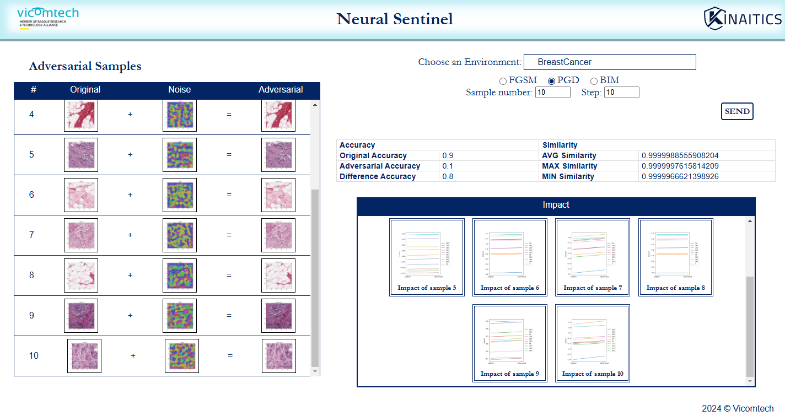

# API Documentation

**Version:** 1.0.11  
**Base URL:** `https://0.0.0.0:8888/`  
**Description:** NeuralSentinel evaluates the vulnerability of artificial neural networks (ANNs) to evasion attacks. The system analyzes adversarial robustness by simulating attacks, such as FGSM, PGD, and BIM, while providing visualizations of original, noisy, and adversarial samples, as well as their impacts.

---

## Endpoints

### 1. **Initialize Scenario**
**Endpoint:** `POST /initialize`  
**Description:** Set up the analysis process by initializing the context for a specific scenario.

- **Parameters:**
  - `scenario` (query, *required*): The dataset or scenario to analyze.  
    Allowed values: `"BreastCancer"`, `"BrainCancer"`  

- **Responses:**
  - `200`: Successful initialization of the chosen scenario.
  - `400`: Invalid parameter supplied.
  - `404`: Scenario not found.

---

### 2. **FGSM Attack Evaluation**
**Endpoint:** `GET /fgsm`  
**Description:** Evaluates the ANN model's robustness under a Fast Gradient Sign Method (FGSM) attack.

- **Parameters:**
  - `n_sample` (query, *optional*): Number of samples to analyze.

- **Responses:**
  - `200`: JSON report with metrics including accuracy and similarity scores.
  - `400`: Invalid request.
  - `404`: Data not found.

---

### 3. **PGD Attack Evaluation**
**Endpoint:** `GET /pgd`  
**Description:** Simulates a Projected Gradient Descent (PGD) attack to assess model robustness.

- **Parameters:**
  - `steps` (query, *optional*): Number of iterations for the PGD attack.
  - `n_sample` (query, *optional*): Number of samples to analyze.

- **Responses:**
  - `200`: JSON report with metrics including accuracy and similarity scores.
  - `400`: Invalid request.
  - `404`: Data not found.

---

### 4. **BIM Attack Evaluation**
**Endpoint:** `GET /bim`  
**Description:** Evaluates the ANN model using a Basic Iterative Method (BIM) attack.

- **Parameters:**
  - `steps` (query, *optional*): Number of iterations for the BIM attack.
  - `n_sample` (query, *optional*): Number of samples to analyze.

- **Responses:**
  - `200`: JSON report with metrics including accuracy and similarity scores.
  - `400`: Invalid request.
  - `404`: Data not found.

---

### 5. **Generate Interpretability Visualization**
**Endpoint:** `POST /interpretebility`  
**Description:** Generates graphical interpretations of the impact of adversarial attacks on neural networks.

- **Request Body:**  
  - JSON with the structure:
    ```json
    {
      "values": [],
      "neuros": []
    }
    ```

- **Responses:**
  - `200`: Returns an image (JPEG) visualizing the impact.
  - `400`: Invalid request.
  - `404`: Data not found.

---

### 6. **Generate Attack Visualization**
**Endpoint:** `POST /visualization`  
**Description:** Produces visual outputs showing original, noisy, and adversarial samples along with their impacts.

- **Request Body:**  
  - JSON with the structure:
    ```json
    {
      "original": [],
      "adversarial": [],
      "noise": []
    }
    ```

- **Responses:**
  - `200`: Array of visualizations in plain text format.
  - `400`: Invalid request.
  - `404`: Data not found.

---

## Metrics Included in API Outputs

- **Accuracy Metrics:**
  - `original_accuracy`: Accuracy of the model on original data.
  - `adversarial_accuracy`: Accuracy on adversarially perturbed data.
  - `difference_accuracy`: Change in accuracy due to adversarial attacks.

- **Similarity Metrics:**
  - `avg_similarity`: Average similarity between original and adversarial inputs.
  - `max_similarity`: Maximum similarity observed.
  - `min_similarity`: Minimum similarity observed.

---

## Example Usage

### 1. **Initialize a Breast Cancer Analysis Scenario**
```http
POST /initialize?scenario=BreastCancer

```


---

## Visual Output Description

### **Adversarial Samples Table**

- **Columns:**
  - **Original:** Input sample before perturbation.
  - **Noise:** Generated adversarial noise.
  - **Adversarial:** Resulting sample post-perturbation.

### **Impact Graphs**

- Display the change in metrics for each adversarial sample, allowing a granular understanding of attack effects.

### **Accuracy and Similarity Scores**

- Located on the right side of the visualization, summarizing the system's performance.



# Software Requirements

- **Disk:** 10GB
- **Memory:** 16GB
- **CPUs:** 8 or 4


# Scenario Objectives

The **NeuralSentinel Tool** serves as a groundbreaking innovation in evaluating the **resilience and security of Artificial Neural Networks (ANNs)**, with a primary focus on their susceptibility to **evasion attacks**. By simulating adversarial scenarios such as **Fast Gradient Sign Method (FGSM)**, **Basic Iterative Method (BIM)**, and **Projected Gradient Descent (PGD)**, NeuralSentinel provides comprehensive insights into how these attacks affect ANN performance and neuron behavior. This capability is especially critical in sensitive application domains, such as healthcare, where model robustness is paramount.

---

## Key Objectives

### 1. **Assessment of ANN Vulnerabilities**
NeuralSentinel is designed to identify and assess vulnerabilities in ANN models against evasion attacks. The tool evaluates:
- **Model Accuracy**: Measures the performance of the ANN under adversarial conditions compared to its performance with clean input data.
- **Neuron Behavior**: Tracks how specific neurons are affected during adversarial attacks, helping to pinpoint weaknesses in the network architecture.

---

### 2. **Evasion Attack Simulation**
NeuralSentinel generates **adversarial examples** by applying industry-standard attack techniques and reports detailed metrics, including:
- **Accuracy Metrics**:
  - **Original Accuracy**: Accuracy on the clean dataset.
  - **Adversarial Accuracy**: Accuracy on adversarially perturbed data.
  - **Difference Accuracy**: The difference between original and adversarial accuracies to highlight vulnerability levels.
- **Similarity Metrics**:
  - Quantifies the visual and structural differences between the original and adversarial images, including:
    - **Average Similarity**
    - **Maximum Similarity**
    - **Minimum Similarity**
- **Impact Attribute**:
  - Introduces a novel metric that highlights the **most affected neurons** during adversarial attacks. This visualization is critical for identifying weak points in the ANN.

---

### 3. **Healthcare-Specific Scenarios**
NeuralSentinel includes **three preconfigured healthcare environments** to demonstrate its capabilities using real-world datasets and models. These environments offer insights into ANN vulnerabilities in critical medical contexts:

#### - **Breast Cancer Environment**:
  - **Model**: A convolutional neural network (CNN) based on the pretrained **VGG16** model.
  - **Classification**: Identifies breast tissue as either **normal (class 0)** or **cancerous (class 1)**.
  - **Dataset**: Consists of breast tissue images labeled according to cancer presence.

#### - **Brain Cancer Environment**:
  - **Model**: A CNN based on the pretrained **EfficientNet** model.
  - **Classification**: Categorizes brain images into **four classes**:
    - **Normal (class 0)**
    - **Cancer Type 1 (class 1)**
    - **Cancer Type 2 (class 2)**
    - **Cancer Type 3 (class 3)**
  - **Dataset**: Includes brain images labeled based on cancer type or absence of cancer.

#### - **Aortic Calcification Environment**:
  - **Model**: A CNN developed at the **Fondazione Monasterio Medical Center**.
  - **Classification**: Classifies chest resonance images into:
    - **Normal (class 0)**
    - **Diseased (class 1)**.
  - **Dataset**: Consists of chest resonance images labeled based on the presence or absence of aortic calcification.

---

### 4. **Defense Mechanisms and Resilience Testing**
NeuralSentinel allows users to assess ANN robustness under **defended scenarios**, applying **state-of-the-art defense mechanisms** to preconfigured environments. These defenses include:
- **Adversarial Training**: Strengthening the model by training it with adversarial examples.
- **Dimensionality Reduction**: Reducing the input feature space to minimize adversarial impact.
- **Prediction Similarity**: Evaluating the consistency of predictions under perturbations to ensure model stability.

Each defense mechanism can be applied and analyzed across the included healthcare environments or any custom environment added by the user.

---

### 5. **Visual Interpretability and Explainability**
NeuralSentinel provides an intuitive visualization interface that:
- Displays adversarial samples, including:
  - **Original Images**
  - **Generated Perturbations (Noise)**
  - **Adversarial Examples** created by combining original images with noise.
- Highlights neuron impact during attacks using the **impact attribute**, offering a clear view of which components of the ANN are most vulnerable.

---

### 6. **Customizable Analysis**
NeuralSentinel is not limited to the predefined healthcare environments. Users can:
- Integrate their own ANN models and datasets.
- Define their own environments for testing, tailoring the analysis to specific use cases.

---

### 7. **Innovation in AI Security**
NeuralSentinel represents a **pioneering advancement** in ANN evaluation. Its unique capabilities include:
- **Comprehensive Attack Simulation**: Enables users to simulate various adversarial scenarios and measure their impact.
- **Defense Mechanism Evaluation**: Tests both well-established and novel defenses to determine their effectiveness against specific attacks.
- **Detailed Vulnerability Insights**: Incorporates transparency techniques like the **impact attribute** to pinpoint the weakest components of the model.

---

## Research Contributions and Recognition

NeuralSentinel's innovative contributions have been validated by the scientific community:
- Accepted at the **AIMLA 2024 Conference in Copenhagen**, a leading event in AI and machine learning advancements.
- Acknowledged as a **significant breakthrough** in ANN evaluation, offering a platform that combines attack simulation, defense testing, and detailed vulnerability analysis.

---

## References
1. Echeberria-Barrio, X., Gil-Lerchundi, A., Goicoechea-Telleria, I., & Orduna-Urrutia, R. (2021). Deep learning defenses against adversarial examples for dynamic risk assessment. *In 13th International Conference on Computational Intelligence in Security for Information Systems (CISIS 2020)* 12 (pp. 316-326). Springer International Publishing.

2. Echeberria-Barrio, X., Gil-Lerchundi, A., Egana-Zubia, J., & Orduna-Urrutia, R. (2022). Understanding deep learning defenses against adversarial examples through visualizations for dynamic risk assessment. *Neural Computing and Applications*, 34(23), 20477-20490.

3. Echeberria-Barrio, X., Gorricho, M., Valencia, S., & Zola, F. (2024). NeuralSentinel: Safeguarding Neural Network Reliability and Trustworthiness. arXiv preprint arXiv:2402.07506.


